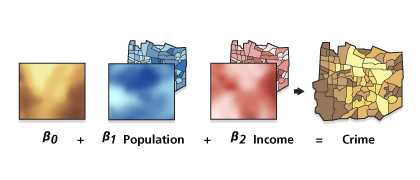
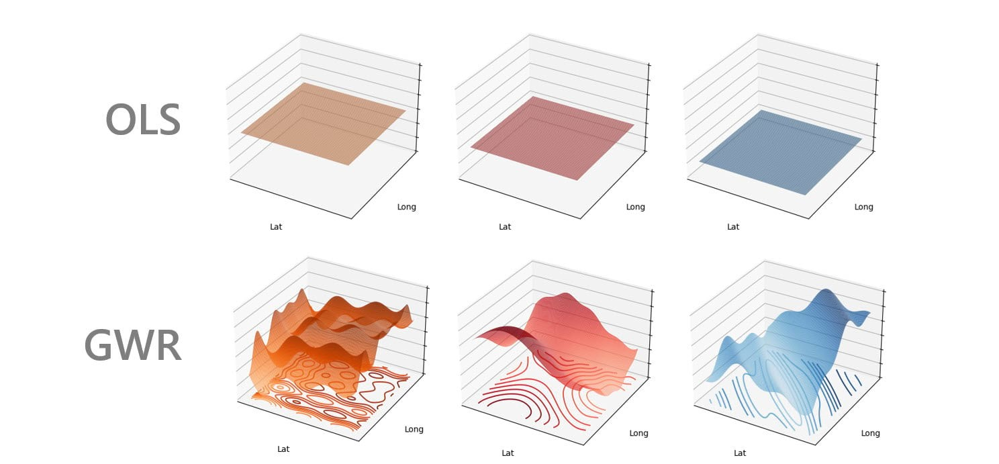
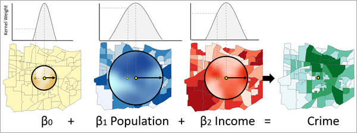

```{r setup, include = F}
# This is the recommended set up for flipbooks
# you might think about setting cache to TRUE as you gain practice --- building flipbooks from scratch can be time consuming
options(width = 70)
knitr::opts_chunk$set(
  dev.args = list(bg = 'transparent'),
  fig.width = 12, message = TRUE,
  warning = FALSE, comment = "", cache = TRUE, fig.retina = 3
)
knitr::opts_knit$set(global.par = TRUE)
Sys.setenv(`_R_S3_METHOD_REGISTRATION_NOTE_OVERWRITES_` = "false")
# remotes::install_github("luukvdmeer/sfnetworks")
# remotes::install_github("EvaMaeRey/flipbookr")
# remotes::install_github("rlesur/klippy")
# devtools::install_github("gadenbuie/xaringanExtra")
library(flipbookr)
library(xaringanthemer)
library(tidyverse)
library(klippy)
library(xaringanExtra)
library(gt); library(knitr); library(kableExtra); library(tibble)
library(summarytools)
```

<style>
.notbold{
    font-weight:normal
}

body {
text-align: justify;
}

h1{
      margin-top: -1px;
      margin-bottom: -3px;
}

.small-code pre{
  margin-bottom: -10px;
  
}  

.medium-code pre{
  margin-bottom: 2px;
  
}

</style>

```{r xaringan-scribble, echo=FALSE}
xaringanExtra::use_scribble()
```

```{r xaringanExtra-clipboard, echo=FALSE}
htmltools::tagList(
  xaringanExtra::use_clipboard(
    button_text = "<i class=\"fa fa-clipboard\"></i>",
    success_text = "<i class=\"fa fa-check\" style=\"color: #90BE6D\"></i>",
    error_text = "<i class=\"fa fa-times-circle\" style=\"color: #F94144\"></i>"
  ),
  rmarkdown::html_dependency_font_awesome()
)
```

```{r xaringan-extra-styles, echo=FALSE}
xaringanExtra::use_extra_styles(
  hover_code_line = TRUE,         #<<
  mute_unhighlighted_code = TRUE  #<<
)
```
<font size = "5">

<br>
<br>
<br>
<br>
<br>

Link slides en formato [html](https://gusgarciacruz.github.io/EconometriaAvanzadaII/GWR/GWR.html)

Link slides en formato [PDF](https://gusgarciacruz.github.io/EconometriaAvanzadaII/GWR/GWR.pdf)

---
# <span style="font-size:80%">En este tema</span>

- <span style="font-size:150%">[<span style="color:black">Motivación](#motivacion)</span> <br> <br>

- <span style="font-size:150%">[<span style="color:black">Especificación de una GWR](#especificacion)</span> <br> <br>

- <span style="font-size:150%">[<span style="color:black">Función de densidad kernel y ancho de banda $h$](#kernel)</span> <br> <br>

- <span style="font-size:150%">[<span style="color:black">Multicolinealidad](#multicolinealidad)</span> <br> <br>

- <span style="font-size:150%">[<span style="color:black">GWR restringido](#restringido)</span> <br> <br>

- <span style="font-size:150%">[<span style="color:black">GWR multi-escala (MGWR)](#mgwr)</span> <br> <br>

- <span style="font-size:150%">[<span style="color:black">Ejercicio aplicado en R](#r)</span>

---
# <span style="font-size:80%">Lecturas</span>
- <span style="font-size:120%">Brunsdon,C., Fotheringham, A.,  Charlton, M. (1996). "Geographically weighted regression: a method for exploring spatial nonstationarity". *Geographical Analysis*, 28(4):281-298<br>

- <span style="font-size:120%">Fotheringham, A., Brunsdon,C., Charlton, M. (2002). *Geographically weighted regression: the analysis of spatially varying relationships*. John Wiley & Sons <br>

- <span style="font-size:120%"> Wheeler, D.C. (2007). "Diagnostic tools and a remedial method for collinearity in geographically weighted regression." *Environment and Planning A*, 39(10):2464–2481 <br>

- <span style="font-size:120%">Wheeler, D.C., Páez, A. (2010). Geographically Weighted Regression. In: Fischer, M., Getis, A. (eds) Handbook of Applied Spatial Analysis. Springer, Berlin, Heidelberg. https://doi.org/10.1007/978-3-642-03647-7_22 <br>

- <span style="font-size:120%">Wheeler, D.C. (2014). Geographically Weighted Regression. In: Fischer, M., Nijkamp, P. (eds) Handbook of Regional Science. Springer, Berlin, Heidelberg. https://doi.org/10.1007/978-3-642-23430-9_77 <br>

- <span style="font-size:120%"> Algunas webs: [crd230](https://crd230.github.io/gwr.html), [quarcs-lab](https://rpubs.com/quarcs-lab/tutorial-gwr1), [MGWR](https://bookdown.org/lexcomber/GEOG3195/spatial-models---geographically-weighted-regression.html) <br>

- <span style="font-size:120%">Paquetes en R: [`spgwr`](https://rsbivand.github.io/spgwr/articles/GWR.html), [`gwrr`](https://cran.r-project.org/web/packages/gwrr/gwrr.pdf), [`GWmodel`](https://cran.r-project.org/web/packages/GWmodel/GWmodel.pdf), [`GWPR.light`](https://cran.r-project.org/web/packages/GWPR.light/GWPR.light.pdf) y [`mgwrsar`](https://cran.r-project.org/web/packages/GWPR.light/vignettes/introduction_of_GWPR.html)

---
name: motivacion
# <span style="font-size:80%">Motivación</span>
<spam style="font-size:112%">
Si estamos interesados en la influencia o efecto de algunas variables $x$ sobre alguna variable $y$, y asumiendo una relación lineal, se puede estimar el siguiente modelo de regresión lineal múltiple (RLM):

$$y_i = \beta_0 + \sum_{k=1}^{p} \beta_kx_{ik} + u_i$$

Aquí $i$ representa una unidad de observación espacial (bloques/manzanas, barrios, comunas, ciudades, regiones...)

Como sabemos, uno de los supuestos del modelo de RLM es que la relación entre las $x$ y $y$ es <span style="color:blue">estacionaria</span>

<span style="color:blue">Efectos $(\beta's)$ estacionarios</span>
<p style="margin-bottom: -1em">
- los coeficientes $\beta$ no cambian a través del tiempo ni el espacio
- en estadística espacial, estacionariedad equivale a la homogeneidad de un efecto o, lo que es lo mismo, a que un proceso funciona igual independientemente de dónde se observe el proceso  

El supuesto de estacionariedad de los $\beta$ puede ser <span style="color:blue">débil</span>, y es posible preguntarnos <span style="color:blue">si las $x$ afectan a $y$ en forma diferente dependiendo de la localización geográfica analizada</span>

En este tema, se va a analizar la <span style="color:blue">desigual distribución espacial</span> en la relación entre dos o más variables $x$ y $y$. El método que se va a cubrir intenta <span style="color:blue">modelar la heterogeneidad espacial</span>, esto es la <span style="color:blue">Regresión Geográficamente Ponderada</span> o <span style="color:blue">Geographically Weighed Regression (GWR)</span> 

---
name: especificacion
# <span style="font-size:80%">Especificación de una GWR</span>
<spam style="font-size:100%">

La GWR fue propuesta por [Brunsdon et al. (1996)](https://onlinelibrary.wiley.com/doi/abs/10.1111/j.1538-4632.1996.tb00936.x) y tiene como objetivo estimar los $\beta$ en cada localización $i$, usando los centróides de los poligonos de los datos utilizados. El modelo tiene la siguiente estructura:

$$y_i = \beta_{i0} + \sum_{k=1}^{p} \beta_{ik}x_{ik} + u_i$$

donde $\beta_{ip}$ es la realización local de $\beta_p$ en la localización $i$

Visualmente sería:

.pull-left-50[
```{r, echo=FALSE, out.width="90%",fig.align='center'}

```
]

.pull-right-50[
```{r, echo=FALSE, out.width="90%",fig.align='center'}

```
]
<br/><br/><br/><br/><br/><br/><br/><br/><br/><br/><br/>
<span style="color:blue">La GWR es una evolución de la regresión por mínimos cuadrados ordinarios (MCO)</span> y añade un nivel de sofisticación al modelo al permitir que las <span style="color:blue">relaciones entre las variables independientes y dependientes varíen según la localización</span>

---
# <span style="font-size:80%">Especificación de una GWR</span>
<spam style="font-size:120%">
Los coeficientes de regresión son estimados para cada localización independientemente por <span style="color:blue">mínimos cuadrados ponderados</span>. La matriz de ponderación es una matriz diagonal en la que cada elemento diagonal $w_{ij}$ es una función de la localización de la observación. La matriz de coeficientes estimados tiene la forma:

$$\pmb{\hat{\beta}}(i) = [\textbf{X}^{T}\textbf{W}(i)\textbf{X}]^{-1}\textbf{X}^{T}\textbf{W}(i)\textbf{y}$$
donde $\textbf{W}(i)=diag[w_1(i),...,w_n(i)]$ es la matriz diagonal de pesos que varia en cada localización $i$. <span style="color:blue">La matriz de ponderación da más valor a las observaciones que están cerca de $i$</span> ya que se supone que las observaciones cercanas se influyen mutuamente más que las lejanas (ley de Tobler)  

<span style="color:blue">El modelo básico de regresión MCO es sólo un caso especial del modelo GWR, en el que los coeficientes son constantes en el espacio</span>

Al estimar una GWR hay que tener en cuenta tres principales aspectos:
<p style="margin-bottom: -1em">
- la función de densidad kernel que asigna las ponderaciones $w_{ij}$ 
- el ancho de banda (*bandwidth*) $h$ de la función, que determina el grado de decaimiento de la distancia
- a quién considerar como vecinos

---
name: kernel
# <span style="font-size:80%">Función de densidad kernel y ancho de banda $h$</span>
<spam style="font-size:96%">

<span style="color:blue">La función de densidad kernel determina el peso asignado a las unidades vecinas</span>

Existen varias funciones de densidad que se pueden utilizar, las más comúnes son:

- la función ponderada Gaussiana:

$$w_{ij} = exp\left(-\frac{d_{ij}^2}{h^2}\right)$$  
donde $d_{ij}$ es la distancia entre la localización $i$ y $j$, y $h$ es el ancho de banda

- la función bicuadrada
$$w_{ij} = 1 - \left(\frac{d_{ij}^2}{h^2}\right)^2$$

- la función tricúbica: 

$$w_{ij} = 1 - \left(\frac{d_{ij}^3}{h^3}\right)^3$$

---
# <span style="font-size:80%">Función de densidad kernel y ancho de banda $h$</span>
<spam style="font-size:100%">

Escoger la función de ponderación también implica escoger el ancho de banda $h$. Existen diferentes formas de hacer esto, pero resaltan dos métodos comúnmente utilizados: el método *cross-validation* (CV) y la minimización del críterio de información de Akaike (AIC) 

- CV
<div>
En este método se intenta encontar la $h$ que minimice la CV. La idea es minimizar la suma de los errores al cuadrado en todas las localizaciones $i$, y se llega a un ancho de banda óptimo. El CV toma la forma:

$$CV = \sum_i [y_i - \hat{y}_{\neq i}(\beta)]^2$$ <div> 
donde $\hat{y}_{\neq i}(\beta)$ es el valor estimado de $y_i$ con la observación diferente al punto $i$  

- AIC
<div>
Minimización del AIC

El procedimiento de estimación del modelo GWR implica:
<p style="margin-bottom: -1em">
1. el ancho de banda kernel es estimado por CV o AIC
2. Los ponderadores son calculados utilizando alguna de las funciones de densidad
3. los coefcientes de regresión son estimados en cada localización $i$

---
name: multicolinealidad
# <span style="font-size:80%">Multicolinealidad</span>
<spam style="font-size:95%">

- Un problema con el modelo GWR es la <span style="color:blue">correlación con los coeficientes estimados</span>, parcialmente debido a la <span style="color:blue">colinealidad</span> en las variables explicatorias de cada modelo local

- <span style="color:blue">El problema de multicolinealidad surge ya que se están usando valores de las variables explicativas en cada modelo local que son muy similares ya que son cercanas en el espacio</span>, y al utilizar un ponderador similar para las observaciones cercanas, se está intensificando la similaridad entre las variables explicativas

- <span style="color:blue">La multicolinealidad de las variables explicatorias localmente ponderadas puede llevar a potencial fuerte dependencia en los coeficientes locales estimados. Esta fuerte dependencia en los coeficientes estimados hace que la interpretación de los coeficientes individuales sea, en el mejor de los casos, tenue, y en el peor, engañosa

- Otro aspecto de la multicolinealidad es que en modelos lineales <span style="color:blue">las varianzas de los coeficientes se inflan. Varianzas infladas en los coeficientes de regresión asociada a la colinealidad local en el modelo GWR puede llevar a <span style="color:blue">sobreestimaciones de las magnitudes del efecto de las covariables y a la inversión del signo de los coeficientes</span>, lo que puede dar lugar a interpretaciones incorrectas de las relaciones en el modelo de regresión

- Otro problema del modelo GWR son los errores estándar asociados a las estimaciones de los coeficientes de regresión. <span style="color:blue">Los cálculos del error estándar en el modelo GWR son sólo aproximados debido a la reutilización de datos para la estimación de parámetros en múltiples ubicaciones y debido al uso de los datos para estimar tanto el ancho de banda del kernel con validación cruzada como los coeficientes de regresión 

- Además, como ya se ha indicado, la colinealidad local puede aumentar las varianzas de los coeficientes de regresión estimados. Este problema con los errores estándar indica que <span style="color:blue">los intervalos de confianza de los coeficientes GWR estimados son sólo aproximados y no son exactamente fiables para indicar los efectos estadísticamente significativos de las covariables y la selección de modelos

---
name: restringido
# <span style="font-size:80%">GWR restringido</span>
<spam style="font-size:120%">

- Los problemas derivados de la colinealidad pueden resolverse <span style="color:blue">limitando la cantidad de variación de los coeficientes de regresión 

- En el caso del modelo GWR, se han propuesto dos versiones de métodos que logran este objetivo: <span style="color:blue">*geographically weighted ridge regression* (GWRR)</span> y el <span style="color:blue">*geographically weighted lasso regression* (GWL)

- Estas técnicas son basadas en las regresiones *ridge* y *lasso*, y los métodos funcionan <span style="color:blue">penalizando la regresión para limitar la variación de los coeficientes</span>. En ambos casos, se introduce una restricción en el tamaño de los coeficientes de regresión

- Los coeficientes de la regresión *ridge* minimizan la suma de una penalización sobre el tamaño de los coeficientes al cuadrado y la suma de los residuales al cuadrados

- Los coeficientes del *lasso* minimizan la suma del valor absoluto de los coeficientes y la suma de los residuales al cuadrados

- <span style="color:blue">Tanto en la regresión *ridge* como en el *lasso*, es práctica común centrar la variable de respuesta, y centrar y escalar las variables explicativas para que tengan varianzas unitarias (estandarizar las variables), porque los métodos dependen de la escala

---
name: mgwr
# <span style="font-size:80%">GWR multi-escala (MGWR)</span>
<spam style="font-size:100%">

- En un modelo GWR estándar <span style="color:blue">un sólo ancho de banda o *bandwidth* es determinado y aplicado a cada variable explicativa. 

- Sin embargo, en la realidad puede suceder que las <span style="color:blue">relaciones en algunos procesos espacialmente heterogéneos operen sobre escalas más grandes que en otros 

- En este caso, <span style="color:blue">la escala de no estacionariedad de la relación determinada por una GWR estándar puede subestimar o sobrestimar la escala de las relaciones individuales entre la variable dependiente y las explicativas 

- Para abordar esta limitación del GWR estándar, un <span style="color:blue">GWR multi-escala (MGWR)</span> puede ser usado ([Yang 2014](https://research-repository.st-andrews.ac.uk/bitstream/handle/10023/7052/WenbaiYangPhDThesis.pdf?sequence=3%26isAllowed=y); [Fotheringham, Yang, and Kang 2017](https://www.tandfonline.com/doi/full/10.1080/24694452.2017.1352480); [Oshan et al. 2019](https://www.mdpi.com/2220-9964/8/6/269)) $\Longrightarrow$ Este modelo determina el <span style="color:blue">*bandwidth* para cada una de las variables explicativas, permitiendo así que varíen las relaciones individuales entre $Y$ y cada $X$

```{r, echo=FALSE, out.width="50%",fig.align='center'}

```

- Trabajos recientes han sugerido que el MGWR debería ser el GWR por defecto ([Comber et al. 2022](https://onlinelibrary.wiley.com/doi/full/10.1111/gean.12316)), utilizándose un GWR estándar sólo en circunstancias específicas


---
name: r
# <span style="font-size:80%">Ejercicio aplicado en R</span>
<spam style="font-size:110%">

En este ejercicio se van a utilizar los datos de Columbus, una ciudad en el estado de Ohio en Estados Unidos. La idea es analizar los efectos del ingreso y el valor de la vivienda sobre el nivel de crimen a nivel de barrio.

Archivos a descargar: 
- [Descripción de los datos](https://geodacenter.github.io/data-and-lab/columbus/)
- [Código](https://gusgarciacruz.github.io/EconometriaAvanzadaII/GWR/L5_2.R)


