```{r setup, include = F}
# This is the recommended set up for flipbooks
# you might think about setting cache to TRUE as you gain practice --- building flipbooks from scratch can be time consuming
options(width = 70)
knitr::opts_chunk$set(
  dev.args = list(bg = 'transparent'),
  fig.width = 12, message = TRUE,
  warning = FALSE, comment = "", cache = TRUE, fig.retina = 3
)
knitr::opts_knit$set(global.par = TRUE)
Sys.setenv(`_R_S3_METHOD_REGISTRATION_NOTE_OVERWRITES_` = "false")
# remotes::install_github("luukvdmeer/sfnetworks")
# remotes::install_github("EvaMaeRey/flipbookr")
# remotes::install_github("rlesur/klippy")
# devtools::install_github("gadenbuie/xaringanExtra")
library(flipbookr)
library(xaringanthemer)
library(tidyverse)
library(klippy)
library(xaringanExtra)
library(gt); library(knitr); library(kableExtra); library(tibble)
library(summarytools)
```

<style>
.notbold{
    font-weight:normal
}

body {
text-align: justify;
}

h1{
      margin-top: -1px;
      margin-bottom: -3px;
}

.small-code pre{
  margin-bottom: -10px;
  
}  

.medium-code pre{
  margin-bottom: 2px;
  
}

p.comment {
background-color: #E1E1FF;
padding: 10px;
border: 1px solid white;
margin-left: 25px;
border-radius: 15px;
text-align: justify;
}

div.block { 
background-color: #E1E1FF;
padding: 10px;
border: 1px solid white;
margin-left: 25px;
border-radius: 15px;
text-align: justify;
}

</style>

```{r xaringan-scribble, echo=FALSE}
xaringanExtra::use_scribble()
```

```{r xaringanExtra-clipboard, echo=FALSE}
htmltools::tagList(
  xaringanExtra::use_clipboard(
    button_text = "<i class=\"fa fa-clipboard\"></i>",
    success_text = "<i class=\"fa fa-check\" style=\"color: #90BE6D\"></i>",
    error_text = "<i class=\"fa fa-times-circle\" style=\"color: #F94144\"></i>"
  ),
  rmarkdown::html_dependency_font_awesome()
)
```

```{r xaringan-extra-styles, echo=FALSE}
xaringanExtra::use_extra_styles(
  hover_code_line = TRUE,         #<<
  mute_unhighlighted_code = TRUE  #<<
)
```
<font size = "5">

<br>
<br>
<br>
<br>
<br>

Link slides en formato [html](https://gusgarciacruz.github.io/EconometriaAvanzada/ModelosPanelEspacial/ModelosPanelEspacial.html)

Link slides en formato [PDF](https://gusgarciacruz.github.io/EconometriaAvanzada/ModelosPanelEspacial/ModelosPanelEspacial.pdf)

---
# <span style="font-size:80%">En este tema</span>

- <span style="font-size:150%">[<span style="color:black">Motivación](#motivacion)</span> <br>

- <span style="font-size:150%">[<span style="color:black">Principios básicos en el tratamiento de datos espaciales](#principios)</span> <br>

- <span style="font-size:150%">[<span style="color:black">Efectos espaciales](#espaciales)</span> <br>

- <span style="font-size:150%">[<span style="color:black">Heterogeneidad espacial](#heterogeneidad)</span> <br>

- <span style="font-size:150%">[<span style="color:black">Autocorrelación o dependencia espacial](#autocorrelacion)</span> <br>

- <span style="font-size:150%">[<span style="color:black">Análisis exploratorio de datos en el espacio](#exploratorio)</span> <br>

- <span style="font-size:150%">[<span style="color:black">Análisis confirmatorio de datos espaciales](#confirmatorio)</span> <br>

- <span style="font-size:150%">[<span style="color:black">Regresión espacial](#regresion)</span> <br>

- <span style="font-size:150%">[<span style="color:black">Ejercicio aplicado en R](#r)</span> 

---
# <span style="font-size:80%">Lecturas</span>
<font size = "5">
- Elhorst, J.P. (2010). "Applied Spatial Econometrics: Raising the Bar". *Spatial Economic Analysis*, 5(1):9–28

- Millo, G. y Piras, G. (2012). "splm: Spatial Panel Data Models in R". *Journal of Statistical Software*, 47(1):1–37

- Elhorst, J.P. (2014). *Spatial Econometrics from Cross-Sectional Data to Spatial Panels*, Springer

- LeSage, J. y Pace, R. (2014). "Interpreting spatial econometrics models". En Fischer, M. y Nijkamp, P. (Eds.), *Handbook of Regional Science*, Springer

- Halleck Vega, S. y Elhorst, J.P. (2015). "The SLX model",  *Journal of Regional Science*,  55(3):339-363

- Golgher, A. y Voss, P. (2016). "How to interpret the coefficients of spatial models: spillovers, direct and indirect Effects". *Spatial Demography*, 4:175–205

- Belotti, F., Hughes, G. y Mortari, A. (2017). "Spatial panel-data models using Stata",  *The Stata Journal*,  17(1):139-180.

---
name: motivacion
# <span style="font-size:80%">Motivación</span>
<font size = "5">

- Cuando se trabajan con datos de corte transversal suelen aparecer los denominados <span style="color:blue">efectos espaciales</span>: la <span style="color:blue">heterogeneidad</span> y la <span style="color:blue">dependencia espacial

- <span style="color:blue">Heterogeneidad espacial</span>: este efecto aparece cuando se utilizan datos de unidades espaciales muy distintas para explicar un mismo fenómeno $\Longrightarrow$ aparecen problemas como la <span style="color:blue">heteroscedasticidad</span> o la <span style="color:blue">inestabilidad estructural

- <span style="color:blue">Dependencia espacial</span>: o autocorrelación espacial, surge siempre que el valor de una variable en un lugar del espacio está relacionado con su valor en otro u otros lugares del espacio

- Mientras la heterogeneidad espacial puede ser tratada por técnicas estándar de econometría, la dependencia espacial no. Esto se debe a la <span style="color:blue">multidireccionalidad que domina las relaciones de interdependencia entre unidades espaciales

- La econometría espacial, como subdisciplina de la econometría, surge como respuesta para resolver la presencia de efectos espaciales

---
# <span style="font-size:80%">Motivación</span>
<font size = "5">

El término econometría espacial fue introducido por Jean Paelinck en los 70. En el libro *Spatial Econometrics*, Paelinck y Klaassen resaltan cinco características del campo en términos de los temas considerados:

- el rol de la interdependencia espacial en los modelos espaciales 

- las asimetrías en las relaciones espaciales

- la importancia de factores explicatorios localizados en otros espacios

- diferenciación entre interacciones *ex post* y *ex ante*

- modelación explicita del espacio

---
# <span style="font-size:80%">Motivación</span>
<font size = "5">

- [R](https://cran.r-project.org/)
- Matlab
- [GeoDa](http://spatial.uchicago.edu/)
- [QGis](http://www.qgis.org/en/site/)
- ArcGis
- Stata

---
# <span style="font-size:80%">Motivación</span>
<font size = "5">
Fuentes de información de datos espaciales:
- [SIGOT](http://sigotvg.igac.gov.co:8080/)
- [GeoDa](http://spatial.uchicago.edu/sample-data)
- [IDESC-Cali](http://www.cali.gov.co/planeacion/publicaciones/3560/idesc/) 
- [Medellín](https://geomedellin-m-medellin.opendata.arcgis.com/)
- [IDECA-Bogotá](https://www.ideca.gov.co/)
- [Mapas del mundo](http://thematicmapping.org/downloads/world_borders.php)

---
name: principios
# <span style="font-size:80%">Principios básicos en el tratamiento de datos espaciales</span>
<spam style="font-size:115%">

Paelinck y Klaassen (1979) destacan cinco principios básicos en el campo de la econometría espacial y el tratamiento de datos de corte transversal en general:

- <span style="color:blue">Interdependencia</span>: todo modelo espacial ha de caracterizarse por su interdependencia, es decir, deben incorporarse relaciones mutuas entre las observaciones de las variables económicas, sociales, demográficas, etc.

- <span style="color:blue">Asimetría</span>: las relaciones espaciales son, en principio, asimétricas

- <span style="color:blue">Alotopía</span>: se ha de buscar a priori "la causa" de un fenómeno espacial en otro lugar

- <span style="color:blue">No linealidad</span>: la no linealidad de soluciones espaciales óptimas *ex-ante* conduce a modelos econométricos *ex-post* que requieren una atención particular en lo que respecta a su especificación, lo cual generalmente será no lineal

- <span style="color:blue">Inclusión de variables topológicas</span>: dado que la vida económica se desarrolla necesariamente en el espacio geográfico, un modelo espacial debe incorporar variables topológicas: coordenadas, distancias, superficies, densidades, etc.

De acuerdo a Paelink y Klaassen (1979), no siempre será posible observar estos cinco principios de construcción de modelos espaciales y probablemente pueden haber otros además de los aquí especificado

---
name: espaciales
# <span style="font-size:80%">Efectos espaciales</span>
<font size = "5">

Causas de la dependencia espacial:
<p style="margin-bottom: -1em">
- la delimitación arbitraria de las unidades espaciales de observación (ejemplo, zonas censales, limites municipales, departamentales...)
- problemas de agregación espacial
- la presencia de externalidades y efectos de desbordamiento

Causa de la heterogeneidad espacial:
<p style="margin-bottom: -1em">
- falta de estabilidad en el espacio del comportamiento u otras relaciones bajo estudio
- esto implica que la forma funcional y los parámetros varían con la localización y no son homogéneos en los datos
- puede ocurrir al estimar modelos econométricos con datos de sección cruzada de unidades espaciales diferentes, como regiones ricas y pobres

La heterogeneidad espacial se puede tratar con la econometría estándar que tenga en cuenta la inestabilidad estructural

---
name: heterogeneidad
# <span style="font-size:80%">Heterogeneidad espacial</span>
<font size = "5">

- <span style="color:blue">Definición</span>: se refiere a la variación en las relaciones en el espacio

- Aspectos de la heterogeneidad espacial:
	- <ins>la inestabilidad estructural</ins>: falta de estabilidad en el espacio del comportamiento de la variables bajo estudio. La forma funcional y los parámetros de una regresión pueden variar según la localización, por tanto, no son homogéneos en toda la muestra
	
  - <ins>la heterocedasticidad</ins>: proviene de la omisión de variables u otras formas de error de especificación que llevan a la aparición de errores de medida 
	
- La heterogeneidad espacial puede tratarse por medio de las técnicas econométricas estándar, en concreto:
	-  parámetros variantes, coeficientes aleatorios (Hildreth y Houck, 1968)
	- *Switching regressions* (Quant, 1958)
	- técnicas de filtraje adaptativo espacial (Foster y Gorr, 1983)
	- expansión espacial de parámetros (Casetti, 1972)
	- regresiones ponderadas geográficamente (Fotheringham et al., 1998)
	
---
name: autocorrelacion
# <span style="font-size:80%">Autocorrelación o dependencia espacial</span>
<spam style="font-size:128%">

- <span style="color:blue">Definición</span>: aparece como consecuencia de la existencia de una relación funcional entre lo que ocurre en un punto determinado del espacio y lo que ocurre en otro lugar

- El valor que toma una variable en una región no viene explicado únicamente por condicionantes internos sino también por el valor de esa misma variable en otras regiones vecinas, <span style="color:blue">incumpliéndose por tanto el supuesto de independencia entre las observaciones muestrales

- La autocorrelación espacial puede ser positiva o negativa
- <ins>Positiva</ins>: la presencia de un fenómeno determinado en una región lleva a que se extienda ese mismo fenómeno hacia el resto de regiones que la rodean, favoreciendo así la concentración del mismo

- <ins>Negativa</ins>: cuando la presencia de un fenómeno en una región impida o dificulte su aparición en las regiones vecinas a ella, es decir, cuando unidades geográficas cercanas sean netamente más disímiles entre ellas que entre regiones alejadas en el espacio (tablero de ajedrez)

- Cuando la variable analizada se distribuye de forma aleatoria, no existirá autocorrelación espacial

---
# <span style="font-size:80%">Autocorrelación o dependencia espacial</span>
<spam style="font-size:115%">

<span style="color:blue">Causas</span>: la existencia de errores de medida y fenómenos de interacción espacial
	
<ins>Errores de medida</ins>: pueden surgir, entre otros aspectos, como consecuencia de una escasa correspondencia entre la extensión espacial del fenómeno económico bajo estudio y las unidades espaciales de observación

Ejemplo:<br>
La correcta delimitación espacial de una variables $x$ corresponde a las áreas ABC<br>
Las observaciones disponibles de $x$ son agregadas a nivel espacial en dos niveles: 1 y 2<br>
Consecuencias: $x_{1}$ observada contendrá a $x_{A}$ y parte de $x_{B}$, al tiempo que $x_{2}$ contendrá a $x_{C}$ y parte de $x_{B}$
		
```{r, echo=FALSE, out.width="70%",fig.align='center'}
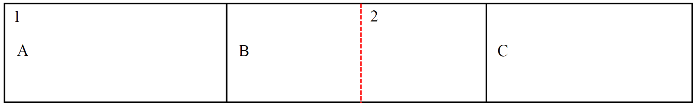
```

Resultado: $x$ estará correlacionada espacialmente aunque de forma espuria

<ins>Interacción espacial</ins>: también entendido como efectos de desbordamiento y de jerarquías espaciales. La existencia de efectos desbordamiento de las infraestructuras de transporte o la difusión tecnológica entre economías son ejemplos claros de fenómenos que favorecen la aparición de interdependencias entre unidades espaciales

---
# <span style="font-size:80%">Autocorrelación o dependencia espacial</span>
<font size = "5">

<span style="color:blue">Matriz de pesos como instrumento para recoger las interdependencias</span>
- Es posible detectar cierta similitud entre los conceptos de autocorrelación espacial y temporal en la medida en que, en ambos casos, se produce un incumplimiento de la hipótesis de independencia entre las observaciones muestrales
- Diferencias entre estos dos tipos de autocorrelaciones: 
<p style="margin-bottom: -1em">
	- <span style="color:blue">la dependencia temporal es únicamente unidireccional</span> $\Longrightarrow$ el pasado explica el presente
	- <span style="color:blue">la dependencia espacial es multidireccional</span> $\Longrightarrow$ una región puede no sólo estar afectada por otra región contigua a ella sino por otras muchas que la rodean, al igual que ella puede influir sobre aquéllas

- La multidireccionalidad de la dependencia espacial imposibilita la utilización del operador de retardos $L$, $L^{p}x_{t}=x_{t-p}$, ya que recoge sólo únicamente una relación unidireccional

---
# <span style="font-size:80%">Autocorrelación o dependencia espacial</span>
<spam style="font-size:120%">

<span style="color:blue">Matriz de pesos como instrumento para recoger las interdependencias</span>

- La solución al problema de la multidireccionalidad en el contexto espacial para por la definición de la denominada <span style="color:blue">matriz de pesos espaciales, de retardos o de contactos $\textbf{W}$</span>:

$$\textbf{W} = \left[ \begin{array}{cccc}
0      & w_{12} & ... & w_{1N}\\
w_{21} & 0      & ... & w_{2N}\\
\vdots & \vdots & \vdots & \vdots\\
w_{N1} & w_{N2} & ... & 0 \end{array} \right]$$
	

una matriz cuadrada no estocástica cuyos elementos $w_{ij}$ reflejan la intensidad de la interdependencia existente entre cada par de regiones $i$ y $j$

- No existe una definición de $\textbf{W}$ unánimemente aceptada, si bien se ha de cumplir que dichos pesos sean no negativos y finitos (Anselin, 1980)

- De forma habitual se recurre al concepto de congüidad física de primer orden, donde $w_{ij}$ es igual a 1 si las regiones $i$ y $j$ son físicamente adyacentes o a 0 en caso contrario (se asume por definición que $w_{ii}=0$)

---
# <span style="font-size:80%">Autocorrelación o dependencia espacial</span>
<font size = "5">

<span style="color:blue">Matriz de pesos como instrumento para recoger las interdependencias</span>

Existen diversos criterios para la identificación de las regiones vecinas:

```{r, echo=FALSE, out.width="50%",fig.align='center'}
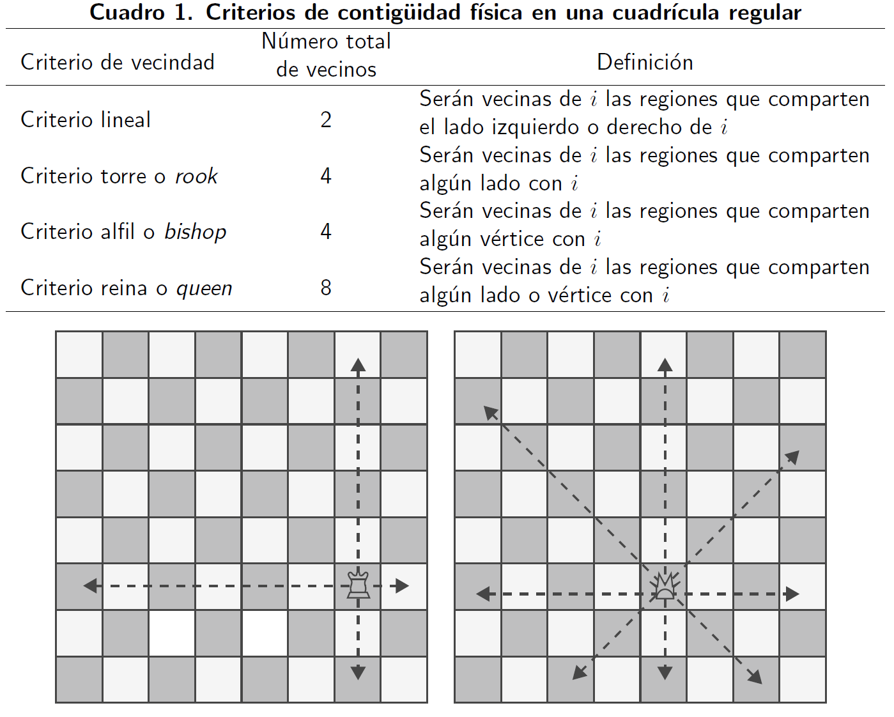
```

---
# <span style="font-size:80%">Autocorrelación o dependencia espacial</span>
<font size = "5">

<span style="color:blue">Matriz de pesos como instrumento para recoger las interdependencias</span>

Limitaciones de la matriz $\textbf{W}$:
- es simétrica, no siendo posible incorporar influencias no recíprocas, violando el segundo de los cinco principios básicos de la econometría espacial

- considera la adyacencia física como único determinante de las interdependencias regionales, descuidando con ello, por ejemplo, posibles influencias mutuas entre regiones, que, aun estando alejadas, mantienen estrechas relaciones comerciales

---
# <span style="font-size:80%">Autocorrelación o dependencia espacial</span>
<spam style="font-size:90%">

<span style="color:blue">Matriz de pesos como instrumento para recoger las interdependencias</span>

Definiciones de $\textbf{W}$ basadas en la utilización de la distancia entre regiones:
- Cliff y Ord (1973, 1981): $w_{ij}=d_{ij}^{-a}\beta_{ij}^{b}$  
	$d_{ij}$: distancia entre $i$ y $j$   
	$\beta_{ij}$: longitud relativa de la frontera común entre $i$ y $j$ con relación al perámetro de $i$  
	$a$ y $b$: parámetros a estimar
- Dacey (1968): $w_{ij}=\gamma_{ij}\beta_{ij}\alpha_{i}$  
	$\beta_{ij}$: igual que antes  
	$\gamma_{ij}$: es un factor de contgüidad binario  
	$\alpha_{i}$: es el área de la región $i$ en relación al área total del sistema
	
- Anselin (1980): matriz inversa de distancias al cuadrado, de manera que la intensidad de la interdependencia entre dos regiones disminuye con la distancia que separa sus respectivos centros

- Bodson y Peeters (1975): función logística que mide la influencia de varios canales de comunicación entre regiones como podrían ser las carreteras, el ferrocarril y otros medios de transporte

$$w_{ij}=\sum_{n=1}^{N} K_{N}\left\{\frac{a}{1+b e^{-c_{j}d_{ij}}}\right\}$$
$K_{N}$: la importancia relativa del medio de comunicación $n$  
$d_{ij}$: la distancia entre dos regiones $i$ y $j$
$N$: el número de medios de comunicación  
$a$, $b$ y $c_{j}$: parámetros a estimar
	
---
# <span style="font-size:80%">Autocorrelación o dependencia espacial</span>
<spam style="font-size:105%">

<span style="color:blue">Matriz de pesos como instrumento para recoger las interdependencias</span>

Definiciones de $\textbf{W}$ basadas en la utilización de la distancia entre regiones:

- Case et al. (1993): $\textbf{W}$ basada en distancias económicas, $w_{ij}=\frac{1}{\left|x_{i}-x_{j}\right|}$
	$x_{i}$ y $x_{j}$: observaciones de características socioeconómicas, tales como la renta per capita
- Vayá et al. (1998a, 1998b) y López-Bazo et al. (1999): $\textbf{W}$ recoge el grado de intercambio comercial entre regiones analizadas

Otras consideraciones sobre $\textbf{W}$:
<p style="margin-bottom: -1em">
- La matriz de pesos debe ser exógena
- Estandarización de la matriz $\textbf{W}$
	- se divide cada elemento $w_{ij}$ por la suma total de la fila a la que pertenece, de forma que la suma de cada fila será igual a la unidad
$$w_{ij}^{*}=\frac{w_{ij}}{\sum_{j}^{n} w_{ij}}$$
	-  la posibilidad de ponderar por igual la influencia total que recibe cada región de sus vecinas, con independencia del número total de vecinos de cada una de ellas, explicaría dicha transformación
	- Anselin (1988) plantea que la estandarización de $\textbf{W}$ no es siempre adecuada, especialmente cuando ésta se basa en un concepto de distancia dado que, en este caso, la matriz estandarizada carecería de significado 
	
---
# <span style="font-size:80%">Autocorrelación o dependencia espacial</span>
<font size = "5">
<span style="color:blue">Matriz de pesos como instrumento para recoger las interdependencias</span>

Un ejemplo de la matriz $\textbf{W}$:

```{r, echo=FALSE, out.width="75%",fig.align='center'}
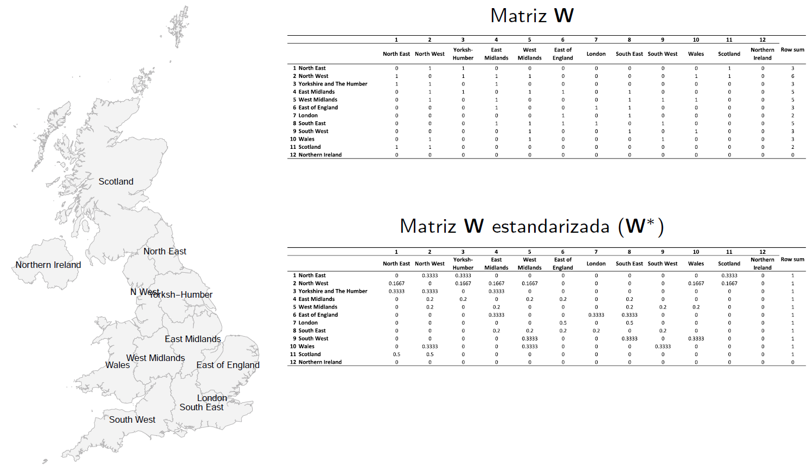
```

---
# <span style="font-size:80%">Autocorrelación o dependencia espacial</span>
<font size = "5">

<span style="color:blue">El operador de retardo espacial</span>

El retardo espacial de una variable resulta del producto de la matriz $W$ y la varaible que se quiere retardar espacialmente:
$$L(y)=\textbf{W}^{*}y=\sum_{j}^{n} w_{ij}^{*}y_{j}$$


```{r, echo=FALSE, out.width="90%",fig.align='center'}
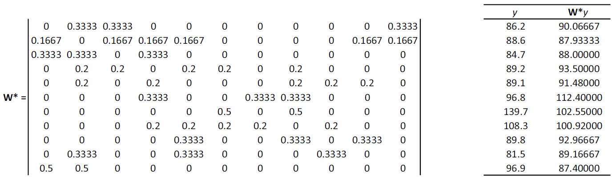
```

---
name: exploratorio
# <span style="font-size:80%">Análisis exploratorio de datos en el espacio</span>
<font size = "5">

- El análisis exploratorio de datos espaciales (ESDA por sus siglas en inglés) se centra de forma explícita en los efectos espaciales:
	- identificar localizaciones atípicas (*outliers* espaciales)
	- descubrir esquemas de asociación espacial (*cluster* espacial)
	- sugerir diferentes regímenes espaciales u otras formas de inestabilidad espacial


- El centro de este concepto lo ocupa la noción de autocorrelación espacial, es decir, el fenómeno por el cual la similitud locacional (observaciones con proximidad espacial) se une con la similitud de valores (correlación de atributos)

- Dimensiones del ESDA:
<p style="margin-bottom: -1em">
 - distinción entre indicadores globales y locales de asociación espacial
 - distinción entre los estadísticos basados en la vecindad y la distancia
 
---
# <span style="font-size:80%">Análisis exploratorio de datos en el espacio</span>
<font size = "5">

<ins>Indicadores globales de asociación espacial</ins>
<p style="margin-bottom: -1em">
- La dependencia espacial se resume en un sólo indicador
- Suelen utilizarse para conocer el rango de interacción espacial en los datos
- Estadísticos: I de Moran y C de Geary


<ins>Indicadores locales de asociación espacial (LISA por sus siglas en inglés)</ins>
<p style="margin-bottom: -1em">
- Un LISA es un indicador que consigue dos objetivos:
<p style="margin-bottom: -1em">
 - que el valor del estadístico obtenido para cada observación suministre información acerca de la relevancia de una agrupación espacial de valores similares alrededor de la misma
 - que la suma del valor del estadístico para todas las observaciones sea proporcional a un indicador global de asociación espacial

- Los LISA resultan fáciles de interpretar mediante la visualización en un mapa

---
# <span style="font-size:80%">Análisis exploratorio de datos en el espacio</span>
<font size = "5">

Modelos de datos en los cuales la autocorrelación espacial puede ser analizada:
- datos geoestadísticos
<p style="margin-bottom: -1em">
	- datos puntuales como una muestra de una distribución continua subyacente
	- se asume que la interacción espacial es una función suave de la distancia entre pares de observaciones
	
- datos *lattice*
<p style="margin-bottom: -1em">
 - una colección fija de localizaciones espaciales discretas (puntos o políginos)
 - la interacción espacial se entiende como una función a pasos según la cual una localización interactúa con un grupo dado de vecinos
 - esta perspectiva es la más comúnmente seguida en la estadísitca espacial y ciencias sociales 
 
---
name: confirmatorio
# <span style="font-size:80%">Análisis confirmatorio de datos espaciales</span>
<spam style="font-size:125%">

- El análisis confirmatorio trata los datos espaciales desde una perspectiva de <span style="color:blue">modelización</span> y está constituido por los distintos métodos de <span style="color:blue">estimación</span>, <span style="color:blue">contrastes de especificación</span> y procedimientos de validación necesarios para implementar <span style="color:blue">modelos multivariantes</span> en los que las observaciones son de corte transversal y están georeferenciados

- Tradicionalmente, el modelo suele estimarse en un primer momento sin incorporar ningún tipo de efecto espacial, de forma que los resultados de la estimación del mismo (y especialmente los residuos) sean el punto de partida de los diagnósticos de dependencia espacial

- Idealmente estos diagnósticos apuntan hacia la dirección correcta en que debe introducirse dicha dependencia espacial en el modelo

- <span style="color:blue">Autocorrelación espacial residual</span>: cuando se deduce la existencia de autocorrelación residual, se reespecifica el término de error con el objetivo de incorporar dicha estructura de dependencia espacial en el mismo

- <span style="color:blue">Autocorrelación espacial sustantiva</span>: en este caso se procede a incorporar la variable dependiente retardada espacialmente como una variable explicativa más en el modelo  

---
# <span style="font-size:80%">Análisis confirmatorio de datos espaciales</span>
<font size = "5">

- La estimación de tales modelos debe realizarse mediante métodos basados en el principio máximo verosímil o en el método genral de los momentos, entre otros

- Una vez hecha la estimación se utilizan diagnósticos y otros procedimientos de validación a fin de seleccionar el más adecuado

- Este conjunto de estadísticos y métodos crean el cuerpo de lo que se conoce como <span style="color:blue">econometría espacial

---
name: regresion
# <span style="font-size:80%">Regresión espacial</span>
<font size = "5">

<ins>**<span style="color:blue">PGD no espacial</span>**</ins>

En el caso lineal:
$$y_{i}=\textbf{x}_{i}\boldsymbol\beta+u_{i}$$
$$u_{i}\sim N(0,\sigma^2), i=1,...,n$$
Supuestos:
<p style="margin-bottom: -1em">
<div class = "block">
<li> Los valores observados en la localización i son independientes de aquellos en la localización j
<li> Los residuales son independientes $\Longrightarrow E[u_{i}u_{j}]=E[u_{i}]E[u_{j}]=0$
</div>

El supuesto de independencia simplifica enormemente el modelo, pero puede ser difícil de justificar en algunos contextos 

---
# <span style="font-size:80%">Regresión espacial</span>
<font size = "5">

<ins>**<span style="color:blue">PGD no espacial</span>**</ins>

Con dos vecinos $i$ y $j$:

$$y_{i}=\alpha_{j}y_{j}+\textbf{x}_{i}\boldsymbol\beta+u_{i}$$
$$y_{j}=\alpha_{i}y_{i}+\textbf{x}_{j}\boldsymbol\beta+u_{j}$$
$$u_{i}\sim N(0,\sigma^2), i=1$$
$$u_{j}\sim N(0,\sigma^2), j=2$$
Supuestos:
<p style="margin-bottom: -1em">
<div class = "block">
<li> Los valores observados en la localización i dependen de aquellos en la localización j y viceversa
<li> El PGD es "simultáneo"
</div>

---
# <span style="font-size:80%">Regresión espacial</span>
<font size = "5">

<ins>**<span style="color:blue">PGD espacial</span>**</ins>

Con $n$ observaciones, se puede generalizar:

$$y_{i}=\rho \displaystyle\sum_{j=1}^{n}$$ $$w_{ij}y_{j}+\textbf{x}_{i}\boldsymbol\beta+u_{i}$$
$$u_{i}\sim N(0,\sigma^2), i=1,...,n$$
En notación matricial:
$$\textbf{Y}=\rho \textbf{W}\textbf{Y}+\textbf{X}\boldsymbol\beta+\textbf{u}$$
$$\textbf{u}\sim N(0,\sigma^2\textbf{I}_{n}), i=1,...,n$$
donde $\textbf{W}$ es la matriz de pesos espaciales, $\rho$ es un parámetro escalar de autocorrelación espacial e $\textbf{I}_{n}$ es una matriz identidad $n\times n$

---
# <span style="font-size:80%">Regresión espacial</span>
<spam style="font-size:110%">

<ins>**<span style="color:blue">PGD espacial</span>**</ins>

- Cuando $\rho=0$, la variable no es espacialmente autocorrelacionada. La información sobre una medida en una localización no nos da información de los valores de las localizaciones vecinas $\Longrightarrow$ <span style="color:blue">independencia espacial

- Cuando $\rho>0$, la variable es positivamente autocorrelacionada espacialmente. Valores vecinos tienden a ser similares unos a otros $\Longrightarrow$ <span style="color:blue">clustering 

- Cuando $\rho<0$, la variable es negativamente autocorrelacionada espacialmente. Valores vecinos tienden a ser diferentes unos a otros $\Longrightarrow$ <span style="color:blue">segregación

.left-column[
<center>
$\rho=0$
```{r, echo=FALSE, out.width="90%",fig.align='center'}
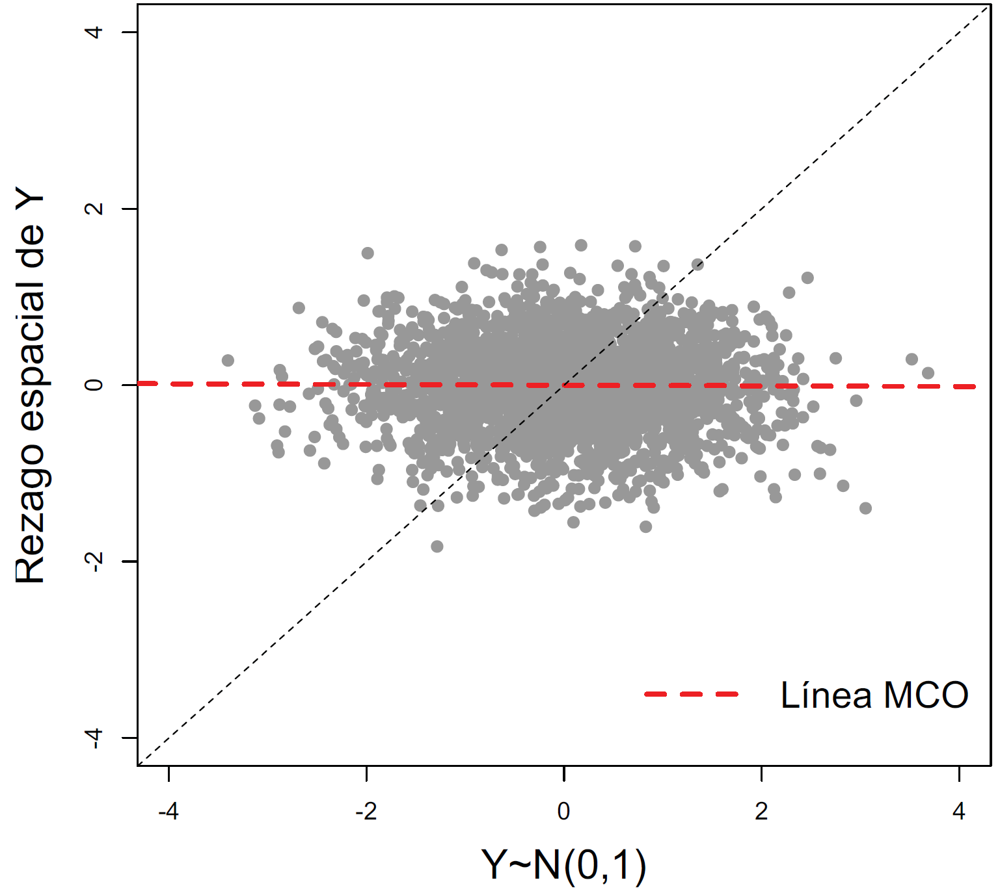
```
]

.left-column[
<center>
$\rho>0$
```{r, echo=FALSE, out.width="90%",fig.align='center'}
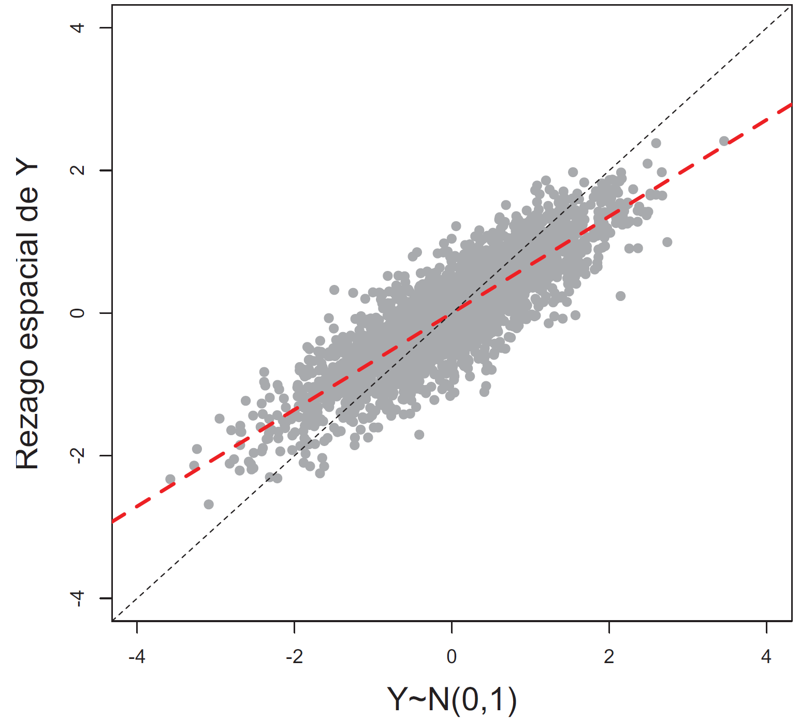
```
]

.left-column[
<center>
$\rho<0$
```{r, echo=FALSE, out.width="90%",fig.align='center'}
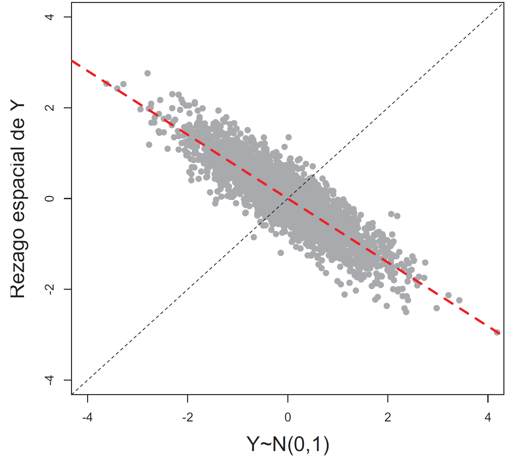
```
]

---
# <span style="font-size:80%">Regresión espacial</span>
<font size = "5">

Manski (1993) resalta que existen tres diferentes tipos de efectos interactivos que pueden explicar por qué una observación asociada con una localización específica puede depender de otra localización:

1. <span style="color:blue">Efectos de interacción endógenos</span>: donde el comportamiento de una unidad espacial (o sus tomadores de decisiones) en una localización depende de la decisión tomada por otras unidades espaciales

2. <span style="color:blue">Efectos de interacción exógenos</span>: donde el comportamiento de una unidad espacial en una localización depende variables explicativas independientes, de otra unidad espacial

3. <span style="color:blue">Efectos correlacionados</span>: donde similares características no observadas dan como resultado un comportamiento similar

---
# <span style="font-size:80%">Regresión espacial</span>
<spam style="font-size:120%">

El modelo de Manski (1993) o modelo más general (<span style="color:blue">*General Nesting spatial model - GNSM*</span>) en tiene la forma:

$$\textbf{Y}=\rho \textbf{W}\textbf{Y} + \alpha\boldsymbol\iota_{N} + \textbf{X}\boldsymbol\beta + \textbf{W}\textbf{X}\boldsymbol\theta + \textbf{u}$$
$$\textbf{u}=\lambda \textbf{W}\textbf{u} + \boldsymbol\epsilon$$
$\textbf{W}\textbf{Y}$: efectos de interacción endógenos entre las variables dependientes  
$\textbf{W}\textbf{X}$: efectos de interacción exógenos entre las variables independientes  
$\textbf{Wu}$: efectos de interacción entre los términos de error de las diferentes unidades espaciales  
$\rho$: coeficiente espacial autorregresivo  
$\lambda$: coeficiente espacial de autocorrelación  
$\theta$ y $\beta$: vectores $K\times 1$ de parámetros fijos y desconocidos

El modelo <span style="color:blue">espacio-tiempo</span> se extiende con efectos específicos espaciales y de tiempo, y tiene la forma:

$$\textbf{Y}_t=\rho \textbf{W}\textbf{Y}_t + \alpha\boldsymbol\iota_{N} + \textbf{X}_t\boldsymbol\beta + \textbf{W}\textbf{X}_t\boldsymbol\theta + \boldsymbol\mu + \xi_t\iota_{N} + \textbf{u}_t$$
$$\textbf{u}_t=\lambda \textbf{W}\textbf{u}_t + \boldsymbol\epsilon_t$$
donde $\boldsymbol\mu=(\mu_1,...,\mu_N)'$. Los efectos específicos de espacio y tiempo pueden ser tratados como efectos fijos o efectos aleatorios

---
# <span style="font-size:80%">Regresión espacial</span>
<font size = "5">

El siguiente diagrama resume una familia de 8 modelos econométricos lineales espaciales en <span style="color:blue">sección cruzada:

```{r, echo=FALSE, out.width="150%",fig.align='center'}
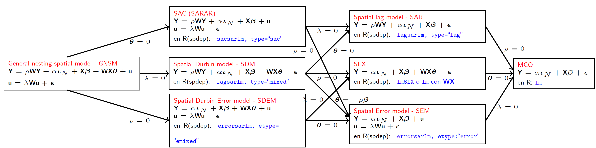
```

---
# <span style="font-size:80%">Regresión espacial</span>
<font size = "5">

El siguiente diagrama resume una familia de 8 modelos econométricos lineales espaciales en <span style="color:blue">datos panel</span> (con efectos fijos o aleatorios, y con o sin efectos específicos de tiempo):

```{r, echo=FALSE,out.width="150%", fig.align='center'}
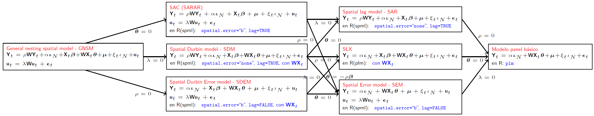
```

---
# <span style="font-size:80%">Regresión espacial</span>
<spam style="font-size:120%">

<ins>**<span style="color:blue">Ineficiencia de los estimadores MCO</span>**</ins>

- En un contexto de series de tiempo, los estimadores MCO siguen siendo consistentes incluso cuando la variable dependiente rezagada esta presente en el modelo, siempre que el términos de error no muestre correlación serial

- Mientras el estimador puede ser sesgado en muestras pequeñas, éste puede aún ser usado para inferencia asintótica

- En un contexto espacial, estas reglas no se mantienen, independientemente de las propiedades del término de error

- Consideremos el modelo SAR de primer orden en corte transversal (covariables omitidas):

$$\textbf{Y}=\rho \textbf{W}\textbf{Y} + \boldsymbol\epsilon$$
- El estimador MCO para $\rho$ es:

$$\widehat{\rho} = \left((\textbf{W}\textbf{Y})'(\textbf{W}\textbf{Y})\right)^{-1} (\textbf{W}\textbf{Y})'\textbf{Y} = \rho + \left((\textbf{W}\textbf{Y})'(\textbf{W}\textbf{Y})\right)^{-1} (\textbf{W}\textbf{Y})'\boldsymbol\epsilon$$
- Similar a series de tiempo, la esperanza del segundo término no es igual a cero

---
# <span style="font-size:80%">Regresión espacial</span>
<font size = "5">

<ins>**<span style="color:blue">Ineficiencia de los estimadores MCO</span>**</ins>

- Asintóticamente, el estimador MCO será consistente si se cumplen dos condiciones:
$$\text{plim } N^{-1}(\textbf{W}\textbf{Y})'(\textbf{W}\textbf{Y})=\textbf{Q}\text{ una matriz finita no singular}$$ 
$$\text{plim } N^{-1}(\textbf{W}\textbf{Y})'\boldsymbol\epsilon=\textbf{0}$$
- Si bien la primera condición se puede satisfacer con restricciones adecuadas sobre $\rho$ y la estructura de $\textbf{W}$, la segunda no se mantiene en el caso especial:

$$\text{plim }N^{-1}(\textbf{W}\textbf{Y})'\boldsymbol\epsilon=\text{plim } N^{-1}\boldsymbol\epsilon'(\textbf{W})(\textbf{I}_{N}-\rho \textbf{W})^{-1}\boldsymbol\epsilon \neq \textbf{0}$$
- La presencia de $\textbf{W}$ en la expresión resulta en una forma cuadrática en el término de error

- A menos que $\rho=0$, el $\text{plim}$ no convergerá a cero

---
# <span style="font-size:80%">Regresión espacial</span>
<font size = "5">

<ins>**<span style="color:blue">Métodos de estimación</span>**</ins>

Tres métodos han sido desarrollados en la literatura para estimar modelos que incluyen efectos de interacción espacial:

- ML: Máxima verosimilitud

- IV/GMM: variables instrumentales o método de los momentos generalizados

- MCMC: \textit{Bayesian Markov Chain Monte Carlo approach}

---
# <span style="font-size:80%">Regresión espacial</span>
<spam style="font-size:130%">

<ins>**<span style="color:blue">Comparación de modelos</span>**</ins>

- El esquema de los 7 modelos espaciales parece sugerir que la mejor estrategia para probar por efectos de interacción espacial es iniciar por el modelo general: $GNSM$

- Sin embargo, como Manski (1993) plantea, al menos uno de los $K+2$ efectos de interacción debe ser excluido, ya que de otra forma los parámetros no podrán ser identificados $\Longrightarrow$ De acuerdo a Manski (1993) no existen limitaciones técnicas para estimar el modelo, pero los parámetros estimados no podrán interpretarse de manera adecuada, ya que los efectos endógenos y exógenos no pueden distinguirse entre sí

- Se esta divido entonces en aplicar dos enfoques: general-a-específico o específico-a-general

- LeSage y Pace (2009) argumentan que el modelo Durbin espacial es el mejor punto de partida

- Florax et al. (2003) han encontrado que una expansión de una ecuación de regresión lineal con variables espacialmente rezagadas, condicional a los resultados sobre pruebas de especificación incorrectas, supera el enfoque general-a-específico para encontrar el verdadero proceso generador de datos

---
# <span style="font-size:80%">Regresión espacial</span>
<spam style="font-size:115%">

<ins>**<span style="color:blue">Comparación de modelos</span>**</ins>

Partiendo del siguiente modelo de regresión lineal:
$$\textbf{Y} = \textbf{X}\boldsymbol\beta + \boldsymbol\epsilon$$
$$\boldsymbol\epsilon \sim N(\textbf{0},\sigma^{2}\textbf{I})$$
la hipótesis de no autocorrelación espacial puede ser contrastada a partir de los siguientes estadísticos:  
<p style="margin-bottom: -1em">
- La I de Moran

- Tests estadísticos basados en el principio de multiplicadores de Lagrange (LM):
<p style="margin-bottom: -1em">
  - LM-Lag
	- Robust LM-Lag
	- LM-Error
	- Robust LM-Error
	- LM-SARMA
	
- En los tests LM los dos primeros se refieren al *spatial lag model* como alternativa, los siguientes dos se refieren al *spatial error model* como alternativa y el último se refiere a un modelo con *spatial lag* y *spatial error*

---
# <span style="font-size:80%">Regresión espacial</span>
<spam style="font-size:115%">

<ins>**<span style="color:blue">Comparación de modelos</span>**</ins>

- Todos los tests comparten una misma hipótesis nula: la ausencia de dependencia espacial

- Sin embargo, el test de la I de Moran no tiene una hipótesis alternativa claramente definida. Con lo cual no sirve para discriminar entre la existencia de un esquema de autocorrelación espacial residual o en la variable dependiente

- Por otra parte, tanto la I de Moran como los contrastes basados en el principio de LM requieren de la normalidad del término de perturbación así como la linealidad del modelo de regresión

- Los tests robustos (Robust LM-Lag y Robust LM-Error) prueban la dependencia espacial robusto a la presencia del otro. Es decir, que el Robust LM-Error prueba por dependencia en el error en la posible presencia errónea de una variable endógena retardada espacialmente, y el Robust LM-Lag al revés

- Lo importante a recordar respecto a los tests robustos es que estos sólo deben considerarse cuando la versión estándar (LM-Lag o LM-Error) son estadísticamente significativos

- Los tests robustos ayudan a determinar que tipo de dependencia espacial existe. Si las medidas robustas de lag y error son ambas significativas, la estructura de la autocorrelación espacial estará determinada por el test robusto con mayor valor

---
# <span style="font-size:80%">Regresión espacial</span>
<font size = "5">
<p style="margin-bottom: -1em">
<ins>**<span style="color:blue">Comparación de modelos</span>**</ins>
<p style="margin-bottom: -2em">
La estrategia simple propuesta por Anselin (2005) y Florax et al (2003) es (*<span style="color:blue">The bottom-up approach</span>*):

```{r, echo=FALSE,out.width="37%", fig.align='center'}
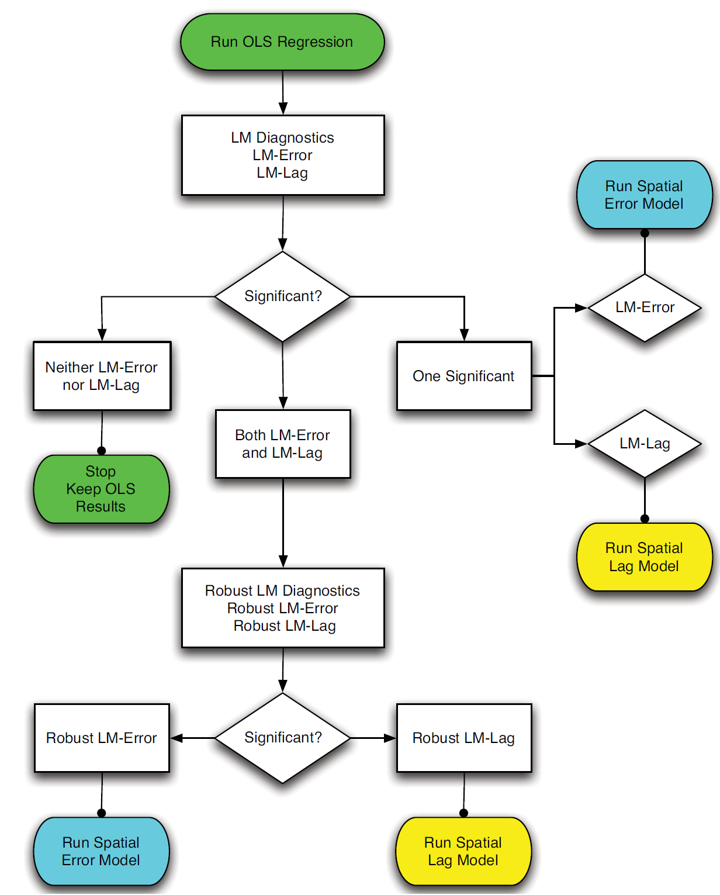
```

---
# <span style="font-size:80%">Regresión espacial</span>
<font size = "5">
<p style="margin-bottom: -1em">
<ins>**<span style="color:blue">Comparación de modelos</span>**</ins>

La estrategia de LeSage y Pace (2009) (*<span style="color:blue">The top-down approach</span>*):

```{r, echo=FALSE,out.width="80%", fig.align='center'}
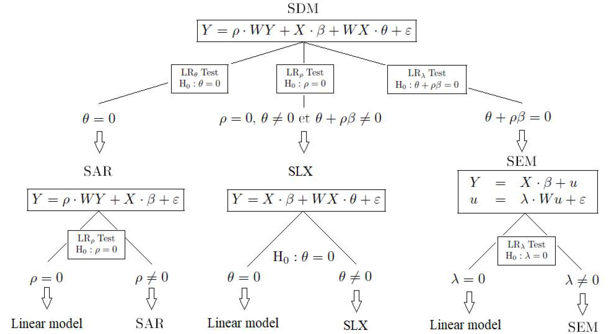
```

---
# <span style="font-size:80%">Regresión espacial</span>
<font size = "5">
<p style="margin-bottom: -1em">
<ins>**<span style="color:blue">Comparación de modelos</span>**</ins>

La estrategia de Elhorst (2010):

```{r, echo=FALSE,out.width="73%", fig.align='center'}
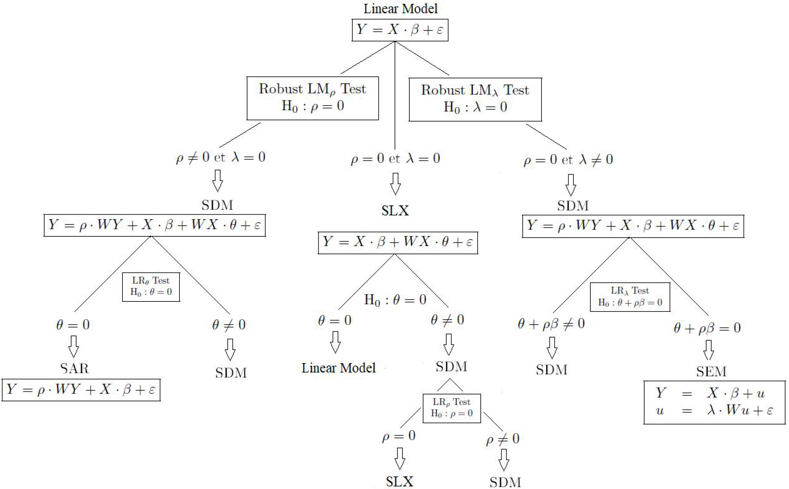
```

---
# <span style="font-size:80%">Regresión espacial</span>
<spam style="font-size:93%">

<ins>**<span style="color:blue">Comparación de modelos</span>**</ins>

Por tanto, Elhorst (2010) propone el siguiente procedimiento para determinar qué modelo es el candidato más probable para explicar los datos:

1. Estime el modelo por MCO y pruebe si el *spatial lag model - SAR* o el *spatial error model - SEM* es más apropiado para describir los datos. Para esto, se puede utilizar el LM-test propuesto por Anselin (1988) y el robust LM-test propuesto por Anselin et al. (1996)

2. Si el modelo MCO es rechazado en favor del *spatial lag model*, *spatial error model* o en favor de ambos modelos, entonces el modelo Durbin espacial debería ser estimado

3. Si estos modelos son estimados por ML, un LR test puede ser usado para probar las hipótesis:
<p style="margin-bottom: -1em">
 - $H_{0}: \theta=0 \Longrightarrow$ prueba si el modelo Durbin espacial se puede simplificar en el *spatial lag model*  
<p style="margin-bottom: -1em">
 - $H_{0}:\theta+\rho\beta=0 \Longrightarrow$ prueba si el modelo Durbin espacial se puede simplificar en el *spatial error model*
				
	 - Si $H_{0}:\theta=0$ y $H_{0}: \theta+\rho\beta=0$ son rechazadas $\Longrightarrow$ modelo Durbin espacial
	 - Si $H_{0}: \theta=0$ no puede ser rechazada $\Longrightarrow$ *spatial lag model* (siempre que el (robust) LM-test diga lo mismo)
	 - Si $H_{0}: \theta+\rho\beta=0$ no puede ser rechazada $\Longrightarrow$ *spatial error model* (siempre que el (robust) LM-test diga lo mismo)
	 - Si el (robust) LM-test a punta a un modelo diferente que el LR test $\Longrightarrow$ modelo Durbin espacial

4. Si el modelo MCO es estimado y no rechaza en favor del *spatial lag model* y el *spatial error model*, el modelo MCO deberá ser re-estimado incluyendo $\textbf{WX}$ o una particular selección de estas $K$ variables para probar $H_{0}: \theta=0$

 - Si la hipótesis no puede ser rechazada $\Longrightarrow$ modelo MCO
 - Si la hipótesis es rechazada $\Longrightarrow$ modelo Durbin espacial y se debe contrastar $H_{0}: \rho=0$
 - Si ésta última hipótesis es rechazada $\Longrightarrow$ modelo Durbin espacial 
 - Si ésta última hipótesis es no rechazada $\Longrightarrow$ modelo SLX
 
---
# <span style="font-size:80%">Regresión espacial</span>
<spam style="font-size:130%">

<ins>**<span style="color:blue">Efectos directos e indirectos (o *spatial spillover effects)*</span>**</ins>

- Muchos estudios empíricos usan las estimaciones puntuales de una o más especificaciones de modelos de regresión espacial ($\rho$, $\theta$ y/o $\lambda$) para deducir conclusiones sobre la existencia de spillovers espaciales $\Longrightarrow$ <span style="color:blue">LeSage y Pace (2009, p. 74) plantean y demuestran que esta práctica lleva a erróneas conclusiones

- Re-escribiendo el modelo *GNSM*:
$$\textbf{Y} = (\textbf{I}-\rho \textbf{W})^{-1}(\textbf{X}\boldsymbol\beta+\textbf{W}\textbf{X}\boldsymbol\theta) + \textbf{R}$$
donde $\textbf{R}$ es un término que contiene el intercepto y el término de error, la matriz de derivadas parciales del valor esperado de $\textbf{Y}$ con respecto a la $k$-ésima variable explicatoria de $\textbf{X}$ es:

$$\left[ \begin{array}{ccc}
\frac{\partial E(\textbf{Y})}{\partial x_{1k}} &  . & \frac{\partial E(Y)}{\partial x_{Nk}}\end{array} \right] = \left[ \begin{array}{ccc}
\frac{\partial E(y_{1})}{\partial x_{1k}} &  . & \frac{\partial E(y_{1})}{\partial x_{Nk}}\\
.                                         &  . & .                                        \\
\frac{\partial E(y_{N})}{\partial x_{1k}} &  . & \frac{\partial E(y_{N})}{\partial x_{Nk}} \end{array} \right]=(\textbf{I}-\rho \textbf{W})^{-1} \left[ \begin{array}{cccc}
\beta_{k}        &  w_{12}\theta_{k} & . & w_{1N}\theta_{k}\\
w_{21}\theta_{k} &  \beta_{k}        & . & w_{2N}\theta_{k}\\
.                &       .           & . & .\\
w_{N1}\theta_{k} &  w_{N2}\theta_{k} & . & \beta_{k} \end{array} \right]$$

---
# <span style="font-size:80%">Regresión espacial</span>
<spam style="font-size:115%">

<ins>**<span style="color:blue">Efectos directos e indirectos (o *spatial spillover effects)*</span>**</ins>

Esta derivada parcial tiene tres importantes propiedades:
1. Si una variable explicatoria particular en una unidad espacial particular cambia, no sólo cambiará la variable dependiente en esa unidad espacial, sino también cambiará en otras unidades espaciales
 - El primer cambio se llama <span style="color:blue">efecto directo</span>: cada elemento de la diagonal
<p style="margin-bottom: -1em">
 - El segundo cambio se llama <span style="color:blue">efecto indirecto</span>:  cada elemento por fuera de la diagonal  <p style="margin-bottom: .5em">
 Los efectos indirectos no ocurren si $\rho=0$ y $\theta_{k}=0$, ya que los elementos por fuera de la diagonal serían cero

2. Los efectos directos e indirectos son diferentes para diferentes unidades espaciales en la muestra
<p style="margin-bottom: -1em">
 - Los efectos directos son diferentes ya que los elementos de la diagonal de la matriz $(\textbf{I}-\rho \textbf{W})^{-1}$ son diferentes para cada unidad espacial, siempre que $\rho\neq 0$
 - Los efectos indirectos son diferentes ya que los elementos de la diagonal de la matriz $(\textbf{I}-\rho \textbf{W})^{-1}$ y de la matriz $\textbf{W}$ son diferentes entre unidades espaciales, siempre que $\rho\neq 0$ y/o $\theta_{k}\neq 0$
	
3. Los efectos indirectos que ocurren si $\theta_{k}\neq 0$ son conocidos como <span style="color:blue">efectos locales</span>, como opuesto al efecto indirecto que ocurre si $\rho\neq 0$ que son llamados <span style="color:blue">efectos globales</span>

---
# <span style="font-size:80%">Regresión espacial</span>
<spam style="font-size:115%">

<ins>**<span style="color:blue">Efectos directos e indirectos (o *spatial spillover effects)*</span>**</ins>

- Ya que los efectos directos e indirectos son diferentes para diferentes unidades espaciales, la presentación de estos efectos puede ser problemático $\Longrightarrow$ $N$ unidades espaciales y $K$ variables explicatorias, se obtiene $K$ diferentes $N\times N$ matrices de efectos directos e indirectos

- LeSage y Pace (2009) proponen lo siguiente:
<p style="margin-bottom: -1em">
 - <span style="color:blue">Efectos directos</span>: promedio de los elementos de la diagonal de la matriz
 - <span style="color:blue">Efectos indirectos</span>: promedio de las filas o las columnas de los elementos por fuera de la diagonal

- <span style="color:blue">Promedio de las filas</span>: el impacto sobre un particular unidad espacial de la variable dependiente ante un cambio en todas las variables explicatorias en todas las unidades espaciales

- <span style="color:blue">Promedio de las columnas</span>: el impacto de cambiar la variable explicatoria en una unidad espacial sobre la variable dependiente de todas las unidades espaciales

- <span style="color:blue">Sin embargo, numéricamente las dos magnitudes son iguales, por lo cual no importa por cual se opte

- <span style="color:blue">Interpretación del efecto indirecto</span>: el impacto de cambiar un particular elemento de una variable exógena sobre la variable dependiente de todas las otras unidades espaciales, lo cual corresponde al promedio del efecto columna

---
# <span style="font-size:80%">Regresión espacial</span>
<font size = "5">

<ins>**<span style="color:blue">Efectos directos e indirectos (o *spatial spillover effects)*</span>**</ins>


```{r, echo=FALSE,out.width="73%", fig.align='center'}
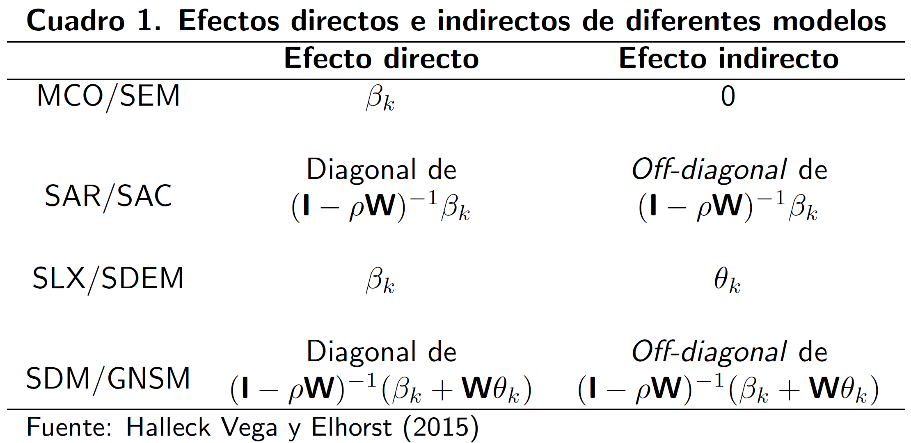
```

---
name: r
# <span style="font-size:80%">Ejercicio aplicado en R</span>
<font size = "5">

En este ejercicio aplicado se va analizar los crímenes violentos en los estados de los Estados Unidos. En los siguientes links se encuentran los datos, el shapefile y el código utilizado en R: 

- [Datos](https://gusgarciacruz.github.io/EconometriaAvanzada/ModelosPanelEspacial/crimes_ts.csv)
- [Shapefile](https://gusgarciacruz.github.io/EconometriaAvanzada/ModelosPanelEspacial/cb_2018_us_state_5m.zip)
- [Código en R](https://gusgarciacruz.github.io/EconometriaAvanzada/ModelosPanelEspacial/L4_2.R)